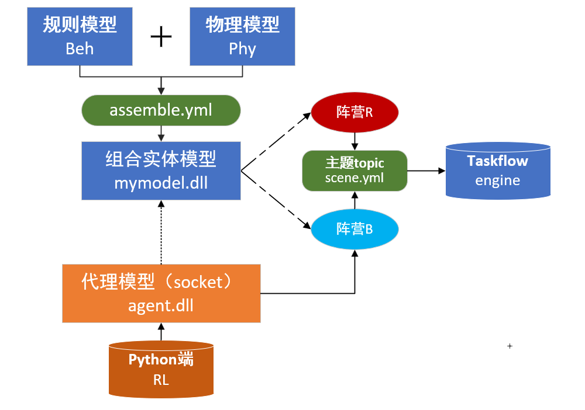

# SimpleCQ代码文件说明

Created: August 21, 2024 10:55 AM

$$
\small \textsf{简单说明引擎运行架构的示例} 
$$

# 3rd-party

## **rapidxml**

解析`.xml`文件

## **taskflow**

并行和异步编程库，表达、简化并行任务，构成有向无环的计算图

## **yaml-cpp**

解析`.yml`文件

# include

## engine⭐

## console.hpp⭐

### `struct Scene`

位置范围、实体状态、draw画布等，用于在控制台窗口的字符可视化

### `struct ConsoleApp`

command calbacks，config

`processCommand`：检查输入的命令是否合法

`replMode()`：⭐

initCfg()、draw()

`loadFile()：`读scene.yml，调用engine进行loadDll、topics、buildGraph等

## executionengine.hpp⭐

### TopicManager

| 模型主题 | **`ModelTopics`** | std::unordered_map<std::string, std::vector<TopicInfo>> |
| --- | --- | --- |
| 标准模型输出 | **`ClassifiedModelOutput`** | std::unordered_map<std::string, std::vector<CSValueMap>> |
| src→target依赖关系 | **`dependenciesOfTarget`** | std::unordered_map<std::string, std::vector<size_t>> |

<aside>
💡 管理主题，构造函数、清理主题和依赖、调用`buffer`的析构函数销毁`TopicBuffer`对象，并使用`new (&buffer) TopicBuffer{}`重新构造一个`TopicBuffer`对象

</aside>

`struct TopicInfo`：判断topic能否连接（有无对应项）、提取字段获得连接目标——datatransform.hpp

`struct TopicBuffer`：管理buffer，包括模型输出、缓存区分配、缓存区切换；用`CacheLinePadding`进行管理，指定数据对齐方式

`dynamicTopicCollect()`：动态输出缓冲区处理，依赖关系映射建立，新任务建立、依赖关系管理、关联新任务与依赖任务

`staticTopicCollect()`：静态输出缓冲区处理，查找主题。

---

### ExecutionEngine

| 交互主题 | `TopicManager` | tm |
| --- | --- | --- |
| 模型 | `ModelManager` | mm |
| 仿真状态 | `struct State` | s→dt/loop/fps |
| tf执行 | `tf::Executor` | executor |
| tf任务流 | `tf::Taskflow` | frame |

`void clear()`

 `struct ModelOutputFunc`：处理模型输出，定义执行主体、模型obj、主题topic列表等，在`operator()`中处理，获取输出数据并根据topic_list输出，

`struct ModelInputFunc`：处理模型输入，逻辑类似上面

`struct ModelTickFunc`：模型`Tick()`

---

`void buildGraph()`：

- 关联topic中src-topic：`targets[model_type].merge(topic.getTargets())`
- 在任务调度框架`frame`中注册topic的任务，包括动态和静态的topic
- **dynamic tasks**：创建动态模型-匹配topic-Output-Init(start loop)-Input-Tick
- **static tasks**：模型匹配topic-Output-添加依赖项-（`GetID()`）⇒  Init-Input-Tick

---

`void run(size_t times = 1)`：执行器运行计算图`executor.run(frame).wait()`&计算仿真时长、循环次数和帧率fps

## callback.hpp

定义结构体`CallbackHandler`，包含：

- 日志级别/是否启用/文件流。
- `std::mutex callback_lock`: 一个互斥锁，用于同步对共享资源的访问。
- 创建模型命令的详细信息，ID、阵营、参数和类型
- `writelog` 日志记录
- `⭐commonCallBack`：动态创建实体”CreateEntity”—`createModelCommands`

## modelmanager.hpp

`struct ModelEntity`：模型类型名称+`ModelObjHandle` 对象（见dllop.hpp，有关dll实例创建）

`struct ModelManager`：

- `createModel`：loadModel-是否为动态创建-`ModelObjHandle`创建dll实体-检查异常。
- `loadDll`：加载dll，返回异常
- `createDynamicModel`：根据callback动态创建实体，结束后清除回调命令。
- `ModelLoader`：加载模型和dll

## coroutined.hpp

1. `#include <coroutine>`：包含了C++20协程库的头文件，它提供了协程的基本功能。
2. `#include "taskflow/taskflow.hpp"`：使用Taskflow提供的各种功能
3. `struct PublishSubscriberManager`：嵌套结构体`promise_type` 是与协程相关的一个类型，定义协程的初始状态和行为；`std::coroutine_handle` 是C++20中用于表示协程句柄的模板类，它允许对协程的控制和操作
4. `struct SimEngine`：`tf::Executor` 是Taskflow库中用于执行任务的组件，使用默认构造函数创建了一个 `Executor` 实例

## mysock.hpp

`struct Link`：利用socket与训练环境通信

- `bool link (const std::string &host, uint32_t port)` :用于建立到指定主机和端口的 TCP 连接。
    - `socket(AF_INET, SOCK_STREAM, IPPROTO_TCP)`:创建TCP套接字
    - `connect(clientSocket, (sockaddr *)&sock_in, sizeof(sock_in)` :建立与指定主机的连接
- `bool sendValue(std::string_view v)` :
    - `send(clientSocket, v.data(), int(v.size()), 0)`：
    通过 `send` 函数向 `clientSocket` 发送字符串数据。`v.data()` 返回字符串视图的指针，`v.size()` 返回字符串视图的大小。
    - `send(clientSocket, &endFlag, 1, 0);`：发送结束标志 `endFlag`，即换行符。
- `std::string getValue()` :
    - 循环调用 `recv` 函数从 `clientSocket` 中接收数据，每次接收的最大长度为 1024 字节。
    - `contentBuffer.get()` 提供了接收数据的缓冲区。
    - `ret += std::string_view{contentBuffer.get(), size_t(num)};` 将接收到的数据追加到 `ret` 中。
    - 当接收到的数据末尾是换行符 `\n` 时，停止接收。

## dllop.hpp

`struct ModelObjHandle`：

- 存储模型dll接口`ModelDllInterface`的实例，包括创建和销毁模型对象的函数指针。初始化为 `nullptr`，表示未加载dll
- 创建实例`CSModelObject *obj`
- 构造函数`ModelObjHandle` ：①默认构造函数，用于创建实例；②禁止通过复制构造函数复制对象；③移动构造函数，用于从右值（即将销毁的对象）移动资源。
- 辅助构造函数`createAs(ModelObjHandle& o) const;`：将当前对象的状态复制到另一个对象 `o`中。
- 析构函数`~ModelObjHandle()`：销毁模型对象并释放资源

`loadModel()`：创建模型对象，存在返回错误信息或不返回，分别对应是否需要检查dll是否存在和是否能够成功加载的场景。

**定义函数：**加载dll、获取dll路径（实现于dllop.cpp）

## parseany.hpp

xml解析，格式化xml数据，数据类型解析。

## datatransform.hpp

`struct TransformInfo`：处理topic定义的数据交互

## dowithcatch.hpp

异常处理，捕获和处理在调用传入函数时可能发生的错误

---

### 无内容文件：

- thread_pool.hpp
- taskgraph.hpp
- tinyffi.hpp 114514
- view.hpp

---

..

# src

## tinycq.cpp⭐

启动前端命令行窗口，解析命令，调用引擎启动。

## test.cpp

引擎运行测试程序

## gym_interface.py⭐

gym格式的通信接口：

..

## dllop.cpp

cqsim格式的dll解析

## model.cpp

组合模型

## agent.cpp⭐

管理代理模型的`Init`、`SetInput`、`Tick`、`GetOutput`，以及创建与销毁。

## ./engine/console.cpp⭐

命令行对应的控制引擎运行的函数

**指令解析：**

| l/load | `app.loadfile`—>`engine.mm.loadDll()`/`engine.buildGraph` |
| --- | --- |
| r/run | `app.engine.run` |
| cfg | `app.cfg.getCallBacks()` |
| get | `app.cfg.getValue()` |
| set | `app.cfg.setValue()` |
| p/print | `app.printBuffer()`—>`printCSValueMap` |
| model | `cout` << models / dynamicModels |